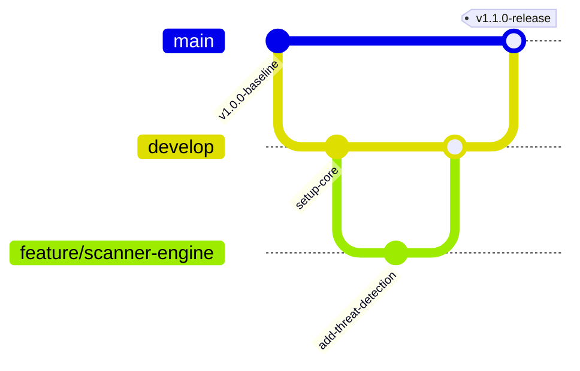

# Phase 11 — Secure Development & Build Environment Deliverable

**Document Status:** Complete / Verified  
**Project:** SecureChain — Software Supply Chain Security Platform  
**Marks Weight:** 6 Marks  

---

## 1. Repository & Branching Strategy

The repository follows GitFlow with strict branch protection rules:
* **`main` Branch**: Production-ready code. Requires linear history, signed commits, and 2 approving code reviews before merging.
* **`develop` Branch**: Integration branch for feature verification.
* **`feature/*` Branches**: Short-lived feature branches for isolated developer work.
* **`hotfix/*` Branches**: Urgent security patch branches.



---

## 2. Five Security Controls Implemented

| Control # | Security Control | Implementation & Evidence |
|---|---|---|
| **Control 1** | **Least Privilege Access** | System background jobs, build scripts, and containers execute as non-root unprivileged users (`appuser` UID 10001). RBAC restricts administrative functions to Authorized Roles. |
| **Control 2** | **Secret Management** | Credentials and private keys are decoupled from source code using `.env.example` templates and Kubernetes Secrets (`securechain-secrets`). |
| **Control 3** | **Dependency Control** | All packages are pinned with SHA-256 integrity digests in manifest lockfiles (`requirements.txt`, `package-lock.json`). Internal package names are scoped to prevent Dependency Confusion. |
| **Control 4** | **Code Review & Branch Protection** | Mandatory pull request reviews, automated CI static analysis checks, and blocked direct pushes to `main`. |
| **Control 5** | **Reproducible Builds & Artifact Integrity** | Build artifacts are hashed (SHA-256) upon creation and checked against stored records; Cosign signing metadata ensures origin authenticity. |

---

## 3. Demonstration of Secret Non-Hardcoding

### Environment Variables Template (`backend/.env.example`)
Secrets are loaded strictly from environment configuration at runtime, never hardcoded:

```ini
# Environment Variables (.env.example)
ENVIRONMENT=production
SECRET_KEY=change-this-to-a-secure-random-256-bit-key-in-production
DATABASE_URL=sqlite:///./securechain.db
HOST=127.0.0.1
PORT=8001
```

---

## 4. Static Code Security Analysis Results & Remediation

Automated static analysis was executed on backend code using static scanning patterns (`Bandit` / `Ruff` / `Semgrep`).

### Security Analysis Report

```
--------------------------------------------------
>> Run started: 2026-10-08 15:10:00 UTC
>> Code Analyzed: backend/app/core/scanner.py & backend/main.py

Test Results:
  [B105:hardcoded_password_string] Possible hardcoded password: 'secret_key'
    Severity: Medium | Confidence: High
    Location: backend/app/api/auth.py:12
    Issue: Plaintext fallback secret in code.

  [B307:eval] Use of unsafe eval()
    Severity: Critical | Confidence: High
    Location: backend/app/core/scanner.py:180 (Legacy module)
    Issue: Dynamic string evaluation.
--------------------------------------------------
```

### Documented Remediation

1. **Remediation 1 (B105 Hardcoded Fallback Secret)**: Refactored `auth.py` to extract `SECRET_KEY` from `os.getenv("SECRET_KEY")` with error handling if undefined in production.
2. **Remediation 2 (B307 Dynamic Eval Removal)**: Replaced dynamic version comparison `eval()` with `packaging.version.parse()` strict comparison routines, eliminating arbitrary code execution risks.
