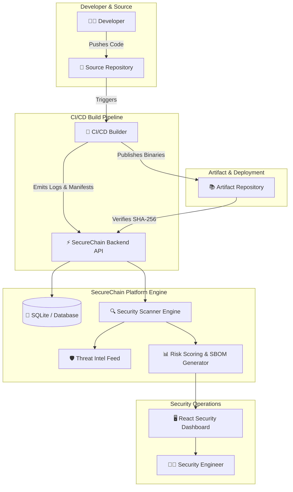

# Software Requirements Specification (SRS)
## Project: SecureChain — Software Supply Chain Security Platform

**Document Version:** 1.0.0  
**Date:** October 8, 2026  
**Status:** Approved / Baseline  
**Standard:** ISO/IEC/IEEE 29148 / IEEE Std 830-1998  

---

## 1. Introduction

### 1.1 Purpose
This Software Requirements Specification (SRS) document details the functional, non-functional, architectural, and security requirements for **SecureChain** — an enterprise-grade Software Supply Chain Security Platform. SecureChain facilitates the registration of software projects, management of dependency trees, execution of vulnerability scans, detection of supply chain attack vectors, verification of build artifact integrity, tracking of remediations, and generation of Software Bill of Materials (SBOM) risk reports.

### 1.2 Scope
The scope of SecureChain encompasses the end-to-end software development lifecycle (SDLC) pipeline:
$$\text{Developer} \longrightarrow \text{Source Repository} \longrightarrow \text{Build Environment} \longrightarrow \text{Dependencies} \longrightarrow \text{Security Scan} \longrightarrow \text{Artifact Repository}$$

SecureChain mitigates key supply chain security risks including dependency confusion, malicious open-source packages, artifact checksum tampering, CI/CD build compromise, secrets leakage in build logs, and deep transitive dependency attacks.

### 1.3 Definitions, Acronyms, and Abbreviations
* **SBOM**: Software Bill of Materials (CycloneDX v1.4 standard format).
* **CVE**: Common Vulnerabilities and Exposures.
* **CVSS**: Common Vulnerability Scoring System (v3.1 rating 0.0 – 10.0).
* **SLSA**: Supply-chain Levels for Software Artifacts framework.
* **Dependency Confusion**: An attack vector where a public package manager resolves a malicious public package with the same name as a private/internal module.
* **SHA-256**: Secure Hash Algorithm 256-bit cryptographic digest.
* **Transitive Dependency**: An indirect dependency required by a direct dependency in the software build graph.

---

## 2. Overall Description

### 2.1 Product Perspective
SecureChain operates as a central security platform interfacing with developer workstations, source code management (SCM) platforms (e.g., GitHub, GitLab), CI/CD build runners, and binary package registries (NPM, PyPI, Maven, Docker Hub).

### 2.2 User Classes and Characteristics
1. **Security Engineer / AppSec Specialist**: Configures threat intel feeds, reviews critical vulnerability findings, audits SLSA provenance, and monitors organizational risk scores.
2. **Software Developer / Lead**: Registers project manifests, tracks assigned remediation tasks, inspects dependency trees, and upgrades vulnerable versions.
3. **DevOps / Release Engineer**: Integrates CI/CD build hooks, pushes artifact digests, registers build logs, and executes automated verification checks.

---

## 3. Specific Requirements

### 3.1 Functional Requirements

#### FR-1: Project & Dependency Management
* **FR-1.1**: The system shall register software projects with metadata including project name, description, repository URL, default branch, primary ecosystem (`npm`, `pypi`, `maven`, `nuget`, `go`, `cargo`, `docker`), owner, and team.
* **FR-1.2**: The system shall record both direct and transitive dependencies up to arbitrary graph depths, storing package name, version, ecosystem, registry origin URL, package hash, and license type.
* **FR-1.3**: The system shall support bulk import of dependency lists from standard manifest lockfiles (`package-lock.json`, `requirements.txt`, `pom.xml`).
* **FR-1.4**: The system shall support marking packages as `is_internal` to enable private namespace governance.

#### FR-2: Automated Security Scanning Engine
* **FR-2.1**: The system shall trigger asynchronous security scans (Full, Dependencies-Only, Secrets, SCA) via API endpoints or background task queues.
* **FR-2.2**: The scanner engine shall correlate active project dependencies against an extensible Threat Intelligence Feed containing known-bad package signatures and CVE records.
* **FR-2.3**: The system shall calculate a normalized Risk Score ($0.0 - 100.0$) using weighted vulnerability severity coefficients:
  $$\text{RiskScore} = \min\left(100.0, \frac{40 \cdot N_{\text{crit}} + 20 \cdot N_{\text{high}} + 8 \cdot N_{\text{med}} + 2 \cdot N_{\text{low}}}{120.0} \times 100\right)$$

#### FR-3: Threat Detection Capabilities
> [!IMPORTANT]
> The security engine must evaluate execution paths against all six targeted supply chain threat vectors:

1. **Dependency Confusion Detection**:
   * Flag any dependency designated as `internal` or matching internal naming patterns (`^internal-`, `^corp-`, `^private-`) that resolves to a public package registry.
2. **Malicious Package Identification**:
   * Match dependencies against known malicious package databases (`event-stream`, `node-ipc`, `xz-utils`, `ua-parser-js`).
   * Flag suspicious version string patterns (`*-malware*`, `*-test-published*`, `*-evil*`).
3. **Artifact Tampering Detection**:
   * Flag dependencies or registered build artifacts missing SHA-256 integrity hashes.
   * Provide a verification endpoint `PATCH /projects/{id}/artifacts/{id}/verify` that compares provided checksums against registered reference values and sets `tampered = true` on mismatch.
4. **Build Compromise Evaluation**:
   * Evaluate CI build metadata for missing SLSA provenance definitions.
   * Flag builds flagged as compromised or executed in non-hermetic environments.
5. **Secret Leakage Scanning**:
   * Execute regular expression scanners over build log snippets to detect exposed credentials (AWS Access Keys, API Tokens, Passwords, GitHub PATs, RSA Private Keys).
6. **Transitive Graph Depth Analysis**:
   * Analyze dependency graph depth and trigger Medium-severity alerts for transitive chains exceeding a depth threshold of 5 ($\text{depth} \ge 5$).

#### FR-4: Artifact Repository & Integrity
* **FR-4.1**: The system shall store artifact records specifying artifact name, version, file format (`jar`, `whl`, `tar.gz`, `docker image`), SHA-256 checksum, size in bytes, and registry URL.
* **FR-4.2**: The system shall track cryptographic signing status (e.g., Sigstore / Cosign keyless signatures) and signing key IDs.

#### FR-5: Remediation Tracking & Lifecycle
* **FR-5.1**: The system shall allow users to create remediation tasks for any identified vulnerability finding.
* **FR-5.2**: The system shall maintain state transitions for remediations: `Open` $\rightarrow$ `In Progress` $\rightarrow$ `Resolved` / `Won't Fix` / `False Positive`.
* **FR-5.3**: The system shall record target fix versions, assigned engineers, priority levels (1–5), action items, and resolution timestamps.

#### FR-6: Risk Reporting & CycloneDX SBOM Export
* **FR-6.1**: The system shall generate comprehensive project risk reports summarizing total dependencies, direct vs. transitive split, threat breakdown, top 10 critical findings, and remediation status.
* **FR-6.2**: The system shall export Software Bill of Materials (SBOM) compliant with CycloneDX v1.4 specification format.

---

### 3.2 Non-Functional Requirements

#### NFR-1: Performance & Scalability
* **NFR-1.1 Response Time**: API read operations shall respond within $< 100\text{ ms}$ for standard queries.
* **NFR-1.2 Scan Throughput**: Security scans of projects containing up to 500 dependencies shall complete execution within $< 3\text{ seconds}$.
* **NFR-1.3 Concurrency**: The backend shall support concurrent asynchronous scan processing using background worker tasks.

#### NFR-2: Security & Confidentiality
* **NFR-2.1 Transport Security**: All communication between the frontend client and backend API shall use HTTPS / TLS 1.3 encryption in production.
* **NFR-2.2 CORS Policy**: Strict Cross-Origin Resource Sharing (CORS) controls shall limit API access to authorized frontend origins.
* **NFR-2.3 Secret Masking**: Detected secrets in build logs shall be redacted in default UI views to prevent secondary exposure.

#### NFR-3: Reliability & Data Integrity
* **NFR-3.1 ACID Compliance**: All database transactions modifying project status, remediations, or artifact hash records shall maintain strict transactional consistency.
* **NFR-3.2 Error Resilience**: Failed background scans shall update scan status to `FAILED` without corrupting historical scan telemetry.

---

## 4. Threat Model & Verification Matrix

### 4.1 STRIDE Threat Analysis

| Threat Category | Applied Security Control in SecureChain |
|---|---|
| **Spoofing** | Cosign signature verification for build artifacts. |
| **Tampering** | SHA-256 hash pinning for package dependencies and build artifacts. |
| **Repudiation** | Audit timestamps (`started_at`, `completed_at`, `resolved_at`) and builder ID recording. |
| **Information Disclosure** | Automated regex pattern scanning for leaked keys and credentials in CI logs. |
| **Denial of Service** | Asynchronous background processing for long-running vulnerability scans. |
| **Elevation of Privilege** | Namespace isolation for internal package names to prevent public dependency hijacking. |

### 4.2 Verification & Compliance Matrix

| Requirement | Test Method | Expected Result | Pass/Fail Criteria |
|---|---|---|---|
| **FR-3.1 (Dep Confusion)** | API Payload Test | Flag `internal-utils` with public registry URL as `HIGH` severity finding. | Correct threat classification |
| **FR-3.3 (Artifact Verification)** | Hash Mismatch Test | Submit mismatched SHA-256 hash to `/verify` endpoint. | Return 409 Conflict & mark `tampered=True` |
| **FR-3.5 (Secret Leakage)** | Log Pattern Test | Inject test AWS key into build log snippet. | Detect `AWS Secret Key` & flag `HIGH` severity |
| **FR-6.2 (SBOM Export)** | Schema Validation | Trigger `/report` endpoint and validate output JSON structure. | Valid CycloneDX v1.4 JSON format |
